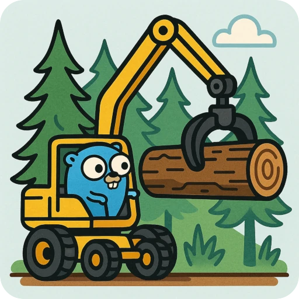

<p align="center">
  
</p>

<h1 align="center">Grapple – Get a grip on your logs</h1>

Grapple is a tiny CLI that downloads log entries from Google Cloud and streams them to stdout as JSON lines.

The project was born out of frustration with `gcloud logging read`, which spends an unreasonable amount of time on JSON serialization.

I created Grapple to scratch my own itch, so it currently supports only the options I use regularly. If you miss a flag or a feature feel free to open an issue.

## Installation

```bash
go install github.com/dippi/grapple@latest
```

This drops a `grapple` executable in `$(go env GOPATH)/bin` – make sure that directory is in your `$PATH`.

## Authentication

Set up Application Default Credentials (ADC):

```bash
gcloud auth application-default login
```

See [the official GCP documentation](https://cloud.google.com/docs/authentication/provide-credentials-adc) for more details.

> [!NOTE]
> Credentials expire frequently. When this happens, simply repeat the authentication procedure.  
> If you know a better way to refresh them directly from the CLI, I’d love to hear it.

## Usage

The interface is heavily inspired by `gcloud logging read` so it should feel familiar:

```bash
grapple --project=my-project \
        --freshness=1h \
        'some.property="value"'
```

### Main Flags

| Flag                        | Description                                                            |
| --------------------------- | ---------------------------------------------------------------------- |
| `--project` (string)        | GCP project ID (**required** when not specified in the config file)    |
| `--freshness` (duration)    | Maximum age of entries (default `1d`)                                  |
| `--from` (RFC3339 datetime) | Start of the time window (mutually exclusive with `--freshness`)       |
| `--to` (RFC3339 datetime)   | End of the time window (mutually exclusive with `--freshness`)         |
| `--order` (`asc`\|`desc`)   | Sort order based on `timestamp` (default `desc`)                       |
| `--config` (file path)      | YAML config file (default `.grapple.yaml` in the CWD and `$HOME` dirs) |

The first positional argument is treated as a Logging filter expression, just like in `gcloud`.

### Configuration File

A sample `.grapple.yaml`:

```yaml
project: my-project
order: asc
```

CLI flags override the values coming from the config.
