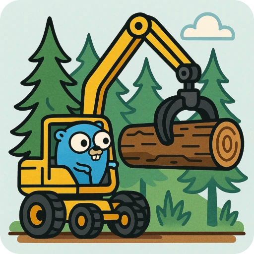

<p align="center">
  
</p>

<h1 align="center">Grapple – Get a grip on your logs</h1>

Grapple is a tiny CLI that downloads log entries from Google Cloud and streams them to stdout as JSON lines.

The project was born out of frustration with `gcloud logging read`, which spends an unreasonable amount of time on JSON serialization.

I created Grapple to scratch my own itch, so it currently supports only the options I use regularly. If you miss a flag or a feature feel free to open an issue.

## Table of Contents

- [Table of Contents](#table-of-contents)
- [Installation](#installation)
  - [Homebrew (recommended on macOS and Linux)](#homebrew-recommended-on-macos-and-linux)
  - [Standalone binaries (all platforms)](#standalone-binaries-all-platforms)
  - [Go install](#go-install)
  - [Shell completions](#shell-completions)
- [Authentication](#authentication)
- [Usage](#usage)
  - [Main Flags](#main-flags)
  - [Configuration File](#configuration-file)

## Installation

### Homebrew (recommended on macOS and Linux)

```bash
brew install dippi/tap/grapple
```

> [!NOTE]
> Earlier versions were distributed as a cask. If you installed one, remove it
> once with `brew uninstall --cask grapple` before installing the formula.

### Standalone binaries (all platforms)

Download the latest archive for your OS/arch from the
[GitHub Releases](https://github.com/dippi/grapple/releases), extract it, and place
the `grapple` binary somewhere in your `PATH` (e.g. `/usr/local/bin`).

> [!NOTE]
> These binaries are not notarized by Apple, so a manually downloaded copy is
> quarantined and Gatekeeper blocks it. Homebrew and `go install` are not
> affected. To run a manual download anyway, clear the attribute:
> `xattr -d com.apple.quarantine /path/to/grapple`.

### Go install

```bash
go install github.com/dippi/grapple@latest
```

This drops a `grapple` executable in `$(go env GOPATH)/bin` – make sure that directory is in your `$PATH`.

### Shell completions

Completions are already included when installing via Homebrew and are also packaged in the release archives under `completions/`.

You can also generate them on the fly:

```bash
# bash
source <(grapple completion bash)

# zsh
source <(grapple completion zsh)

# fish
grapple completion fish | source

# PowerShell
grapple completion powershell | Out-String | Invoke-Expression
```

Persist across shells by sourcing the generated files from your shell profile (e.g. `.bashrc`, `.zshrc`, `config.fish`, or PowerShell profile).

## Authentication

Grapple resolves credentials automatically, in this order, and uses the first method that works:

1. An explicit token passed with `--token` (or `GRAPPLE_TOKEN`).
2. Application Default Credentials (ADC).
3. Your `gcloud` CLI credentials, when `gcloud` is installed and signed in.

Authenticate once with:

```bash
gcloud auth login --update-adc
```

This keeps both the gcloud CLI and ADC fresh in a single sign-in. If ADC expires — for example because your organization enforces a Google Cloud session length — Grapple transparently falls back to your gcloud credentials.

Run `grapple auth status` to see which methods are detected, how Grapple would authenticate, and what to fix if none works. Force a method with `--auth=auto|adc|gcloud`.

See [the official GCP documentation](https://cloud.google.com/docs/authentication/provide-credentials-adc) for more details on ADC.

## Usage

The interface is heavily inspired by `gcloud logging read` so it should feel familiar:

```bash
grapple --project=my-project \
        --freshness=1h \
        'some.property="value"'
```

### Main Flags

| Flag                        | Description                                                            |
| --------------------------- | ---------------------------------------------------------------------- |
| `--project` (string)        | GCP project ID (**required** when not specified in the config file)    |
| `--freshness` (duration)    | Maximum age of entries (default `1d`)                                  |
| `--from` (RFC3339 datetime) | Start of the time window (mutually exclusive with `--freshness`)       |
| `--to` (RFC3339 datetime)   | End of the time window (mutually exclusive with `--freshness`)         |
| `--order` (`asc`\|`desc`)   | Sort order based on `timestamp` (default `desc`)                       |
| `--auth` (`auto`\|`adc`\|`gcloud`) | Credential resolution strategy (default `auto`)                |
| `--token` (string)          | Google Cloud OAuth2 access token (overrides `--auth`)                  |
| `--verbose`                 | Print authentication diagnostics to stderr                             |
| `--config` (file path)      | YAML config file (default `.grapple.yaml` in the CWD and `$HOME` dirs) |

The first positional argument is treated as a Logging filter expression, just like in `gcloud`.

### Configuration File

A sample `.grapple.yaml`:

```yaml
project: my-project
order: asc
```

CLI flags override the values coming from the config.

The config also accepts `auth`.
